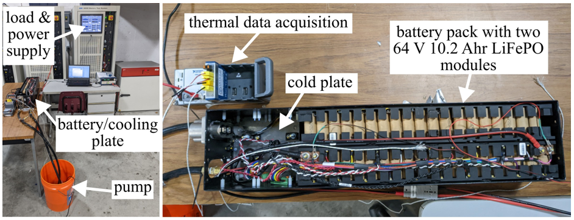
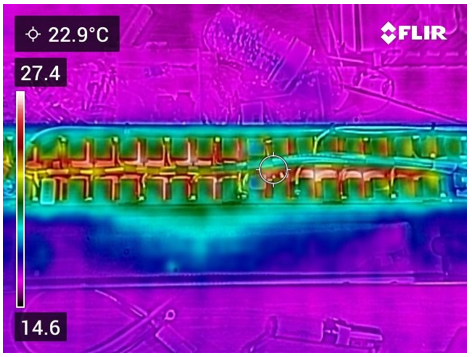

# Battery Pack and BMS
A general repository for custom design elements for a 64v 10.2 Ahr LiFePO battery modules

Figure 1: An image of an existing battery pack connected to the developed data acquisition system.

Figure 2: Thermal image of the battery pack under 0.5C cycling.

## Licensing and Citation

This work is licensed under a Creative Commons Attribution-ShareAlike 4.0 International License [cc-by-sa 4.0].

Cite this as: 

@Misc{ARTSBatteryPackBMS,    
  author = {ARTS-Lab},  
  howpublished = {GitHub},  
  title  = {Battery pack and BMS},  
  groups = {ARTS-Lab},    
  url    = {https://https://github.com/ARTS-Laboratory/battery-pack-and-BMS},   
}
